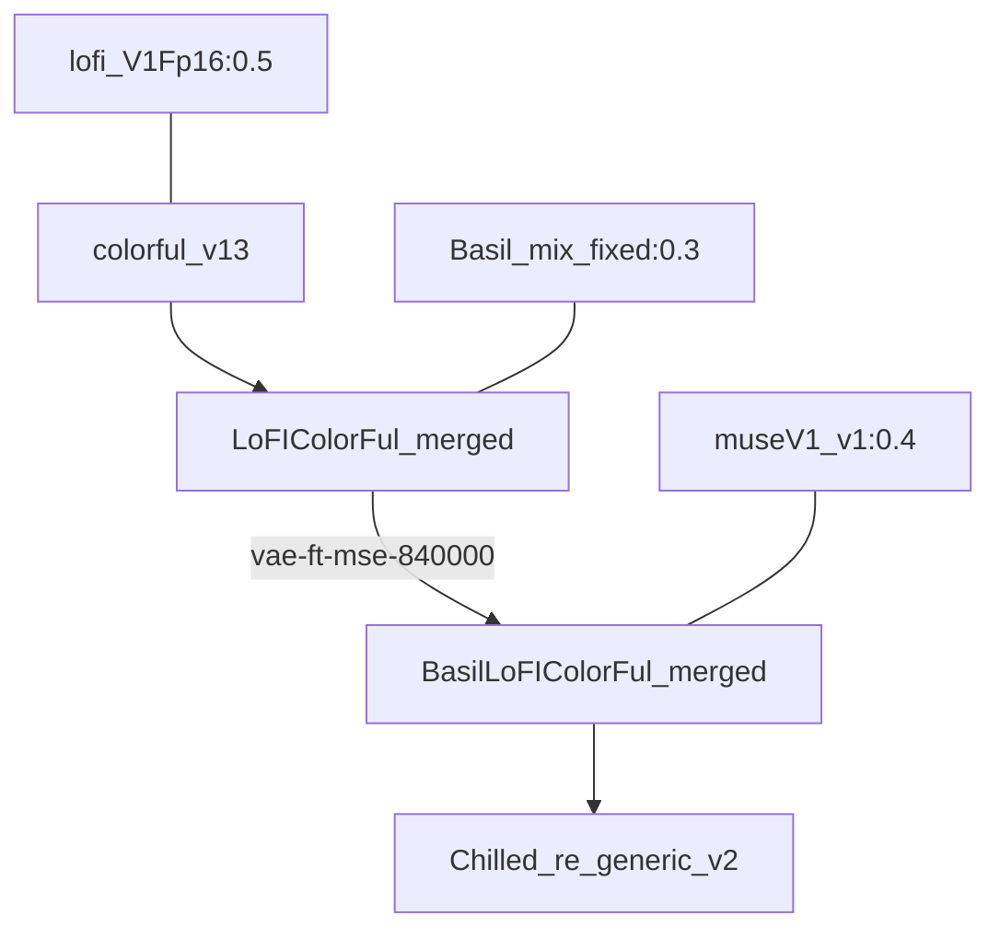

# Chilled_re_generic_v2 Checkpoint

> By [@sazyou_roukaku](https://twitter.com/sazyou_roukaku)
>
> Origin: https://twitter.com/sazyou_roukaku/status/1631603598894436352

## Recipe 

museV1_v1:`0.4` + (Basil_mix_fixed:`0.3 `+ (lofi_V1Fp16:`0.5  `+ colorful_v13) + VAE)

## Steps

## Related Links

・[museV1_v1](https://civitai.com/models/13564/musev1)

・[Basil_mix_fixed](https://huggingface.co/nuigurumi/basil_mix/tree/main)

・[lofi_V1Fp16](https://civitai.com/models/9052/lofi)

・[colorful_v13](https://civitai.com/models/7279/colorful)

・[vae-ft-mse-840000](https://huggingface.co/stabilityai/sd-vae-ft-mse-original/resolve/main/vae-ft-mse-840000-ema-pruned.ckpt)